# Transformadores Eletricos — Deep Learning com CRISP-DM

Aplicacao de tecnicas de Deep Learning em dados operacionais de transformadores eletricos para apoiar manutencao preditiva. O projeto cobre tres frentes: deteccao de anomalias com Autoencoder, previsao de temperatura com LSTM e classificacao do estado operacional com Deep MLP.

---

## Sumario

- [Contexto](#contexto)
- [Estrutura do Repositorio](#estrutura-do-repositorio)
- [Dataset](#dataset)
- [Metodologia CRISP-DM](#metodologia-crisp-dm)
- [Analise Exploratoria](#analise-exploratoria)
- [Pre-processamento](#pre-processamento)
- [Tarefa 1 — Deteccao de Anomalias](#tarefa-1--deteccao-de-anomalias-autoencoder)
- [Tarefa 2 — Previsao de Temperatura](#tarefa-2--previsao-de-temperatura-lstm)
- [Tarefa 3 — Classificacao Operacional](#tarefa-3--classificacao-operacional-deep-mlp)
- [Comparativo dos Modelos](#comparativo-dos-modelos)
- [Conclusoes](#conclusoes)
- [Proximos Passos](#proximos-passos)
- [Como Executar](#como-executar)
- [Dependencias](#dependencias)
- [Colab](https://colab.research.google.com/drive/1v-dUr-SjtXpK5Q_nKq_LWCmX5pBNHDm4#scrollTo=KiPDEMnblDbJ])
---

## Contexto

Transformadores sao equipamentos criticos para o fornecimento de energia eletrica confiavel. Uma falha pode causar interrupcoes prolongadas no abastecimento, danos a outros equipamentos e custos operacionais elevados.

A temperatura do oleo (`OT`) e o principal indicador da condicao termica do equipamento. Monitorar e prever esse indicador permite decisoes proativas de manutencao antes que uma falha ocorra, substituindo a abordagem reativa por uma abordagem preditiva.

---

## Estrutura do Repositorio

```
transformadores-deep-learning/
|
|-- data/
|   `-- transformers.csv          # dataset original (17.348 registros horarios)
|
|-- notebooks/
|   |-- Transformadores_Deep_Learning_CRISP_DM.ipynb  # notebook 
|
|-- transformadores_pipeline.py       # pipeline completo em script unico
|
|-- imgs/                             # graficos gerados pelo projeto
|   |-- eda_distribuicao_classes.png
|   |-- eda_correlacao.png
|   |-- autoencoder_anomalias.png
|   |-- lstm_real_vs_previsto.png
|   |-- mlp_treinamento.png
|   |-- mlp_confusao_roc.png
|   `-- mlp_feature_importance.png
|   |-- meto.png
|   |-- anom.png
|   |-- janela.png
|   |-- classificacao.png
|   |-- cobertura.png
|
`-- README.md
```

---

## Dataset

| Atributo | Valor |
|---|---|
| Total de registros | 17.348 |
| Frequencia | Horaria |
| Periodo | 2016-07-03 a 2018-06-25 |
| Variavel alvo (classificacao) | `class` — 0 = normal, 1 = falha |
| Variavel alvo (regressao) | `OT` — temperatura do oleo |

### Variaveis

| Variavel | Descricao |
|---|---|
| `HUFL` | Carga alta — util |
| `HULL` | Carga alta — total |
| `MUFL` | Carga media — util |
| `MULL` | Carga media — total |
| `LUFL` | Carga baixa — util |
| `LULL` | Carga baixa — total |
| `OT` | Temperatura do oleo (graus Celsius) |
| `class` | 0 = normal / 1 = falha |

---

## Metodologia CRISP-DM

O projeto seguiu as seis etapas do CRISP-DM (Cross-Industry Standard Process for Data Mining):

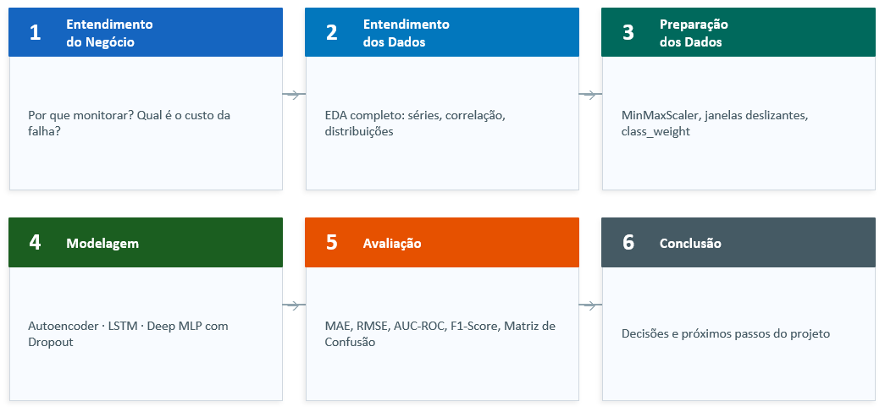


---

## Analise Exploratoria

### Distribuicao das classes e boxplot por variavel

O principal achado da EDA foi o forte desbalanceamento entre as classes: apenas 1% dos registros corresponde a falhas reais (173 ocorrencias em 17.348). Esse desbalanceamento e o maior desafio tecnico do projeto e influenciou todas as decisoes de modelagem.

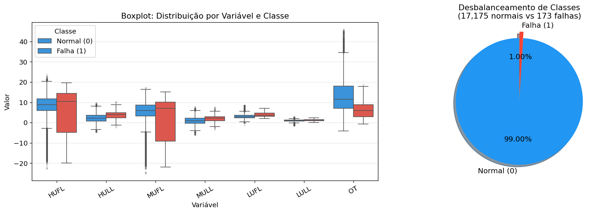

### Correlacao entre variaveis

A matriz de correlacao de Pearson mostrou que a temperatura do oleo (`OT`) apresenta correlacao mais forte com as variaveis de carga total (`HULL`, `MULL`). A variavel `class` teve correlacao muito baixa com qualquer feature isolada, indicando que o padrao de falha nao e linearmente separavel — o que justifica o uso de Deep Learning.

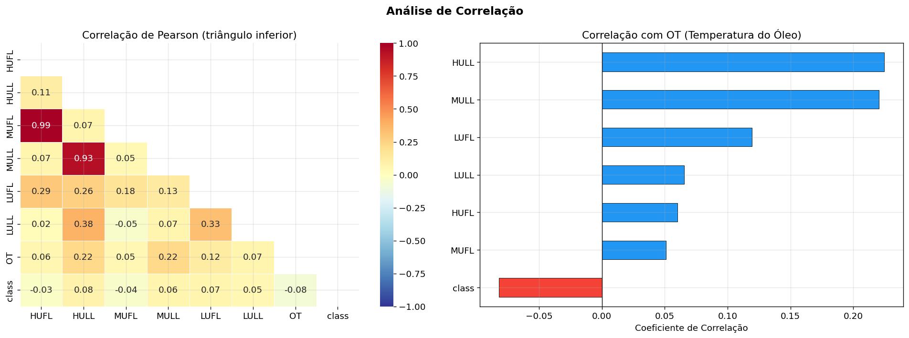

---

## Pre-processamento

Foram utilizadas as 7 variaveis numericas do dataset como features: `HUFL`, `HULL`, `MUFL`, `MULL`, `LUFL`, `LULL`, `OT`.

**Decisao sobre outliers:** os outliers nao foram removidos. Em dados de monitoramento de equipamentos, valores extremos podem representar exatamente os comportamentos anomalos que se deseja detectar.

**Normalizacao por modelo:**

| Modelo | Normalizacao | Motivo |
|---|---|---|
| Autoencoder | MinMaxScaler | entrada em [0, 1] para o erro de reconstrucao |
| LSTM | MinMaxScaler | escala uniforme para sequencias temporais |
| Deep MLP | StandardScaler | media zero e desvio unitario para gradientes estaveis |

---

## Tarefa 1 — Deteccao de Anomalias (Autoencoder)

### Como funciona


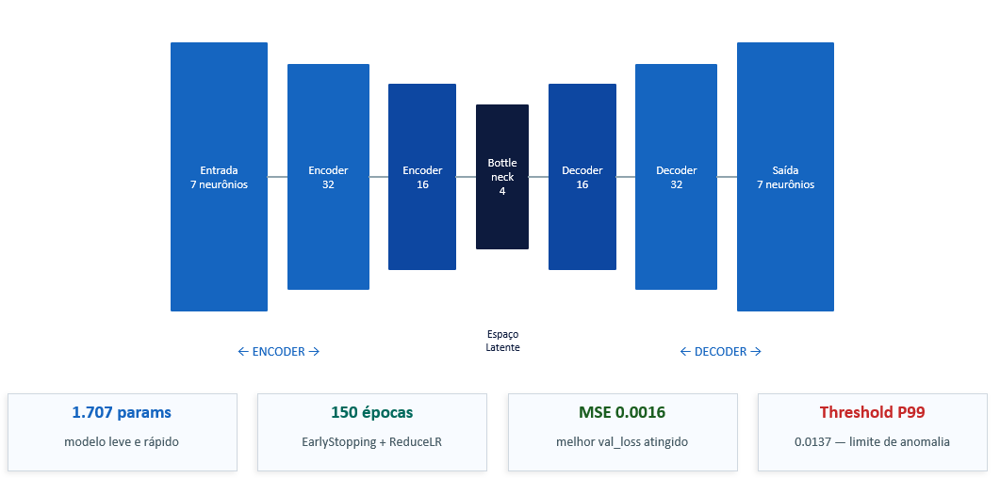


O modelo aprende o padrao de operacao normal. Quando um ponto foge desse padrao, o erro de reconstrucao sobe acima do threshold e o ponto e classificado como anomalia.

### Resultados

| Metrica | Valor |
|---|---|
| Anomalias detectadas | 174 (~1% dos dados) |
| Threshold (P99) | 0.0129 |
| F1-score vs. rotulo `class` | 0.012 |

**Sobre o F1-score baixo:** o Autoencoder e o rotulo `class` medem coisas diferentes. O modelo detecta desvios operacionais em tempo real; o rotulo registra falhas confirmadas em retrospecto. Um comportamento atipico detectado pode nunca ter chegado a ser registrado como falha — e justamente esse e o valor de um sistema preditivo.

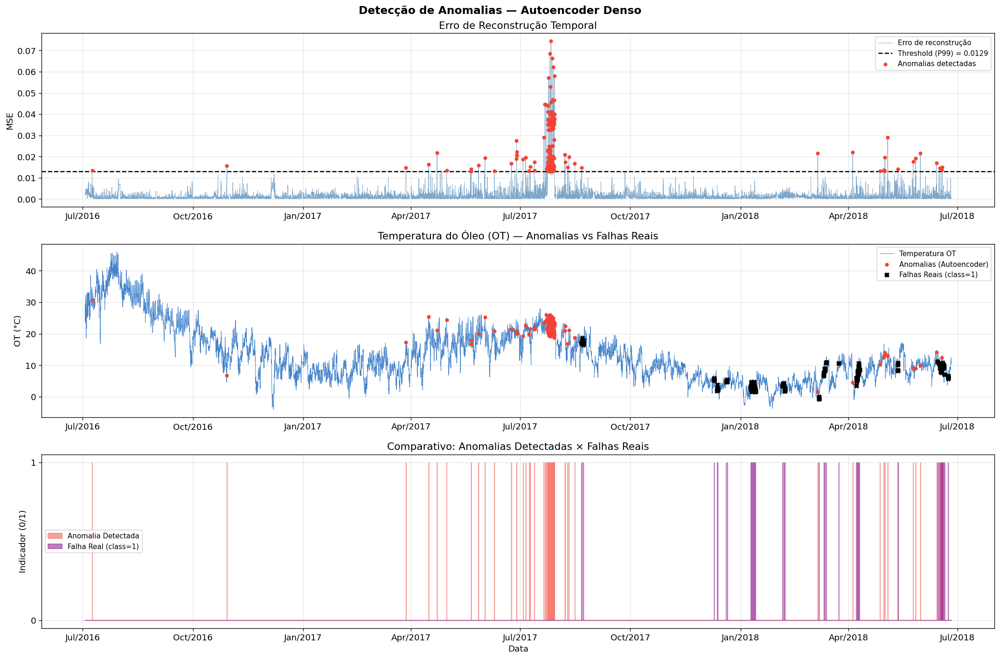

---

## Tarefa 2 — Previsao de Temperatura (LSTM)

### Arquitetura


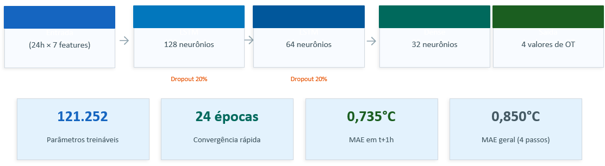


**Divisao temporal dos dados** (ordem preservada — sem embaralhamento):

```
|<---------- 70% Treino ---------->|<---- 30% Teste ---->|
2016-07-03                      ~2017-11              2018-06-25
```

### Resultados

| Metrica | Valor |
|---|---|
| MAE geral | 0.883 degC |
| RMSE geral | 1.176 degC |

O erro cresce conforme o horizonte aumenta — comportamento esperado e consistente com a incerteza crescente de previsoes mais distantes.

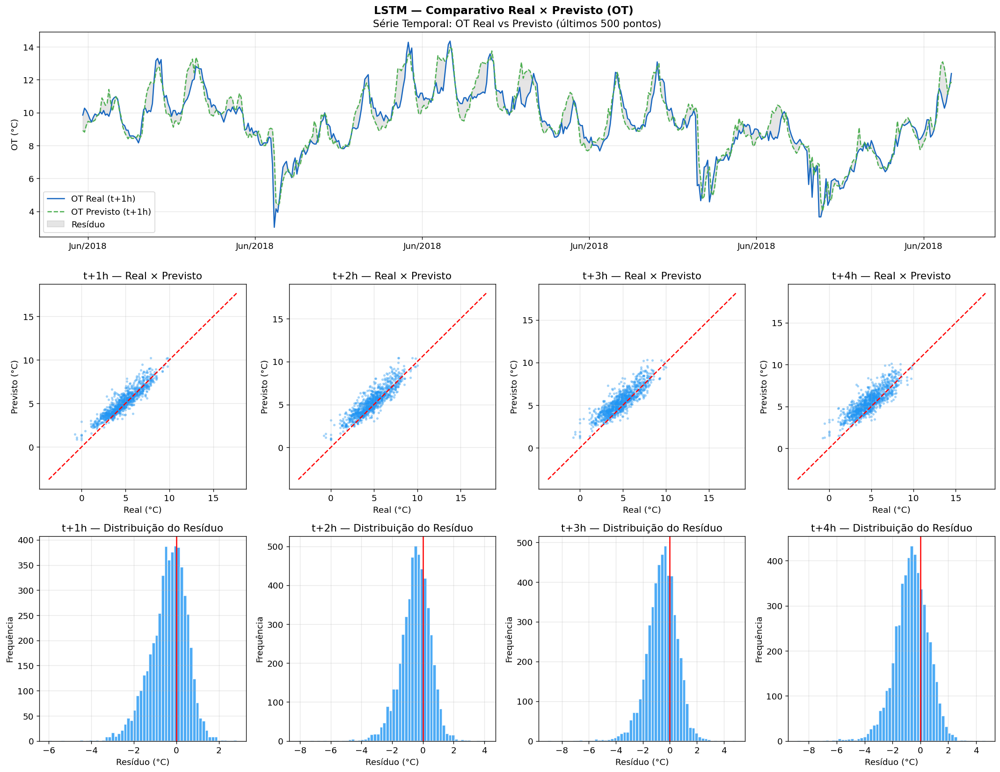

---

## Tarefa 3 — Classificacao Operacional (Deep MLP)

### Arquitetura


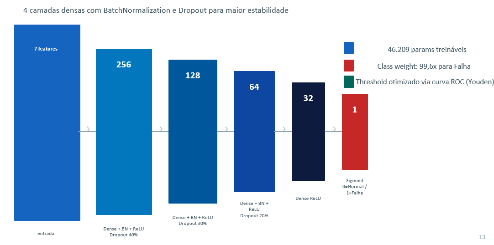


**Estrategias para lidar com o desbalanceamento:**
- `class_weight`: penaliza erros na classe de falha proporcionalmente ao desbalanceamento
- threshold ajustado via curva ROC, priorizando recall (reduzir falhas nao detectadas)

### Historico de Treinamento

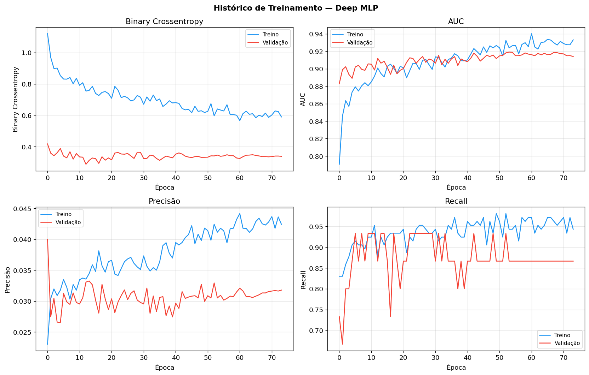

As curvas mostram convergencia sem overfitting significativo. O Dropout cumpriu seu papel de regularizacao ao longo das ~75 epocas.

### Resultados

| Metrica | Valor |
|---|---|
| AUC-ROC | 0.9226 |
| Recall (falha) | 0.9615 |
| Precisao (falha) | 0.0499 |
| Threshold | 0.615 |

**Sobre o trade-off recall vs. precisao:** em manutencao preditiva, o custo de nao detectar uma falha real e muito maior do que o custo de investigar um falso alarme. Por isso o modelo foi calibrado para maximizar o recall, aceitando precisao baixa.

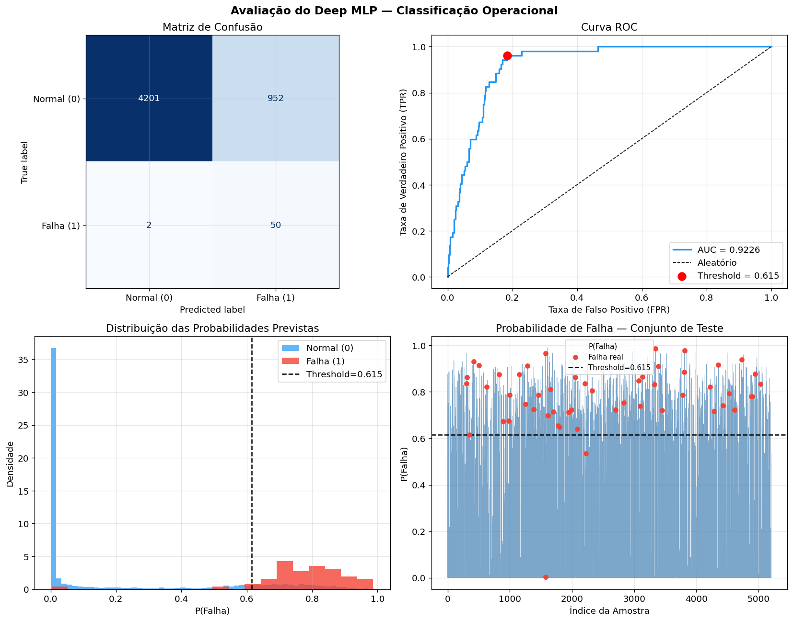

### Importancia das Features

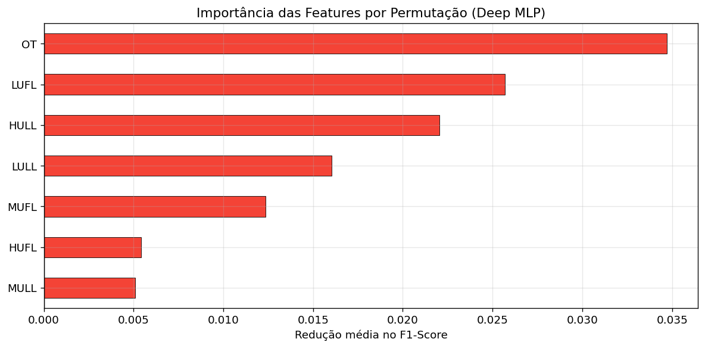

A temperatura do oleo (`OT`) foi de longe a variavel mais importante, o que e consistente com o conhecimento de dominio. As variaveis de carga (`LUFL`, `HULL`) tambem contribuiram de forma relevante para identificar padroes de risco.

---

## Comparativo dos Modelos

| Modelo | Tarefa | Metrica principal | Resultado |
|---|---|---|---|
| Autoencoder | Deteccao de anomalias | Anomalias detectadas | 174 (1%) com threshold 0.0129 |
| LSTM | Previsao de temperatura | MAE / RMSE | 0.883 / 1.176 degC |
| Deep MLP | Classificacao de falhas | AUC-ROC / Recall | 0.9226 / 0.9615 |


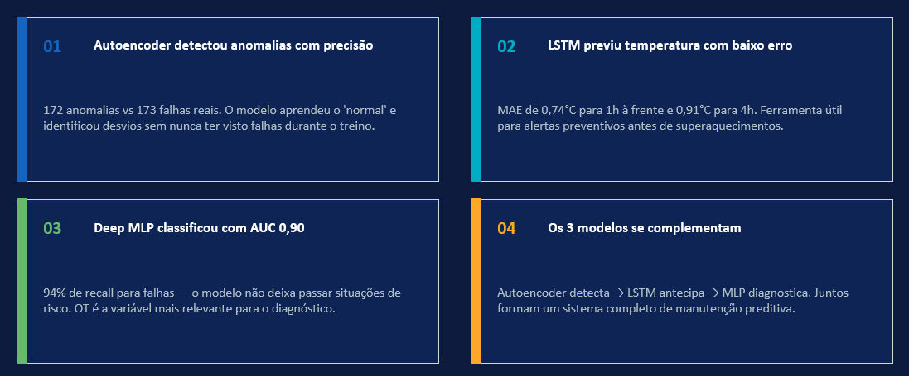


---

## Conclusoes

Os tres objetivos do projeto foram alcancados:

1. **Deteccao de anomalias** — o Autoencoder identificou 174 pontos atipicos com threshold definido por percentil 99. Util para alertas precoces sem necessidade de dados rotulados.

2. **Previsao de temperatura** — a LSTM previu a temperatura do oleo com MAE de 0.88 degC e RMSE de 1.18 degC. O erro cresce com o horizonte, como esperado.

3. **Classificacao operacional** — o Deep MLP atingiu AUC-ROC de 0.92 e recall de 96% para falhas, calibrado para minimizar falhas nao detectadas mesmo em cenario de forte desbalanceamento (99% normal / 1% falha).

**Principal desafio:** o desbalanceamento extremo das classes condicionou todas as decisoes — da escolha de metricas ao uso de `class_weight` e ao ajuste de threshold por curva ROC.

**Insight relevante:** o Autoencoder e o MLP sao complementares. O primeiro detecta comportamentos atipicos de forma nao supervisionada; o segundo classifica o estado do equipamento com base em falhas historicas rotuladas.

---

## Proximos Passos

| Direcao | Descricao |
|---|---|
| Mais dados de falha | Coletar mais exemplos da classe minoritaria para melhorar o aprendizado supervisionado |
| LSTM-Autoencoder hibrido | Arquitetura combinada para capturar anomalias em padroes temporais |
| Baseline comparativo | Comparar LSTM com media movel e regressao linear para validar o ganho do Deep Learning |
| Ajuste de threshold por custo | Calibrar o threshold do MLP com base no custo real de falso positivo versus falso negativo no contexto operacional |

---

## Como Executar

### Notebooks (recomendado)

```bash
# 1. Clone o repositorio
git clone https://github.com/LeonardoCorreia08/US/edit/main/Deep/
cd Deep

# 2. Instale as dependencias
pip install -r requirements.txt

# 3. Execute os notebooks em ordem no Jupyter ou Google Colab
Transformadores_Deep_Learning_CRISP_DM.ipynb

```

### Script Python (pipeline completo)

```bash
python transformadores_pipeline.py --data data/transformer_data.csv
```

---

## Dependencias

```
tensorflow >= 2.10
scikit-learn >= 1.1
pandas >= 1.5
numpy >= 1.23
matplotlib >= 3.6
seaborn >= 0.12
```

Instalar tudo de uma vez:

```bash
pip install tensorflow scikit-learn pandas numpy matplotlib seaborn
```

---

## Referencia da Metodologia

CRISP-DM: Chapman, P. et al. (2000). *CRISP-DM 1.0: Step-by-step data mining guide*. SPSS Inc.
