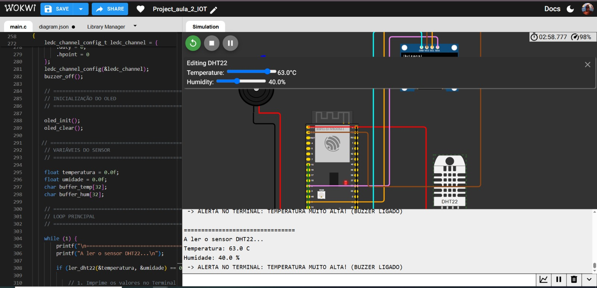
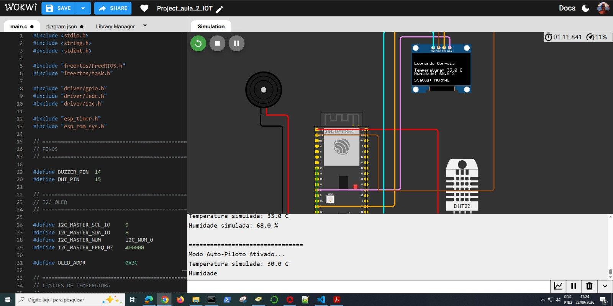

# Atividade Avaliativa Prática 2/6 - Leitura de Sensor

## Descrição do Projeto
Aplicação embarcada desenvolvida para ler dados de um sensor simulado, processar as informações no microcontrolador ESP32-S3 e exibir os resultados em tempo real no monitor serial. O projeto foi estruturado utilizando o ESP-IDF integrado ao VS Code e simulado através da plataforma Wokwi.

## Tecnologias e Ferramentas
* **Ambiente de Desenvolvimento:** VS Code com extensão ESP-IDF.
* **Simulador:** Wokwi (conta configurada e integrada ao VS Code).
* **Linguagem:** C.
* **Hardware Simulado:** ESP32-S3.
* **Sensor Escolhido:** [Substitua pelo sensor escolhido: DHT11 / BMP180 / MPU6050].

## Configuração do Hardware (Circuito)
A montagem no Wokwi respeita o datasheet do sensor selecionado, contemplando:
* **Alimentação:** Conectada aos pinos de tensão adequados do ESP32-S3 (ex: 3.3V ou 5V).
* **GND:** Aterramento comum.
* **Dados:** Pinos de comunicação (I2C, SPI ou GPIO digital) mapeados e configurados no código-fonte.

## Como Executar
1. Clone este repositório em sua máquina local.
2. Abra a pasta do projeto no VS Code com a extensão do ESP-IDF e do Wokwi devidamente ativadas.
3. Certifique-se de que o ambiente ESP-IDF está carregado (variáveis de ambiente configuradas).
4. Compile o código para garantir que não há erros de sintaxe ou de linkagem das bibliotecas do sensor.
5. Inicie a simulação pelo arquivo `diagram.json` (ou equivalente no Wokwi).
6. Acompanhe a saída no monitor serial para visualizar as leituras do sensor.

## Critérios de Avaliação Contemplados
- [x] Configuração do ESP-IDF e da conta Wokwi (50%)
- [x] Circuito montado corretamente no Wokwi (20%)
- [x] Código compilando sem erros (20%)
- [x] Sensor iniciado e dados lidos corretamente (10%)

## Artefatos de Entrega
Os seguintes comprovantes visuais (screenshots) devem ser anexados à raiz deste repositório ou no documento de submissão:
1. Configuração do ESP-IDF e da conta Wokwi ativas.
2. Diagrama do circuito montado corretamente no Wokwi.
3. Terminal demonstrando o log de compilação do código sem erros.
4. Monitor serial exibindo as leituras contínuas do sensor durante a simulação.


# Sistema de Monitoramento de Sensor com ESP32-S3

Este projeto implementa uma aplicação embarcada para leitura e monitoramento de dados em tempo real utilizando o microcontrolador **ESP32-S3**. O sistema estabelece a comunicação com um sensor, processa os dados físicos captados e os transmite continuamente através da interface serial para visualização. 

##  Demonstração com video no  VsCode 


https://github.com/user-attachments/assets/eca1d241-bb93-4741-a15b-0720683de0ca

##  Demonstração no Wokwi com imagem 


**Modo Manual (Ajustando a temperatura manualmente):**


**Modo Autopiloto (Subindo e descendo a temperatura sozinho):**


## Link para wokwi do projeto [aqui](https://wokwi.com/projects/475891325206053889)

A aplicação foi desenvolvida nativamente em **C** utilizando o framework **ESP-IDF** e é projetada para ser executada e validada no ambiente de simulação **Wokwi**.

##  Funcionalidades Principais

* **Comunicação de Hardware:** Configuração de barramentos (como I2C, SPI ou GPIO) no ESP32-S3 para interface com periféricos externos.
* **Leitura Contínua:** Aquisição periódica de dados do sensor DHT22, com exibição das informações no display OLED e acionamento de alertas visuais e sonoros caso a temperatura atinja limites predefinidos, mantendo um loop de execução estável.
* **Processamento de Dados:** Conversão das leituras brutas em valores legíveis (ex: graus Celsius, pressão em hPa, ou eixos X/Y/Z).
* **Telemetria Serial:** Transmissão dos resultados formatados para o monitor serial em tempo real.
* **Tratamento de Falhas:** Verificação do status de inicialização e leitura para evitar travamentos caso o sensor não responda.

##  Tecnologias Utilizadas

* **Linguagem:** C
* **Framework:** ESP-IDF (Espressif IoT Development Framework)
* **Simulação:** Wokwi (Integrado ao VS Code)
* **Microcontrolador:** ESP32-S3
* **Sensor Integrado:** DHT22 (para medição contínua de temperatura e umidade).
* **Display Integrado:** OLED SSD1306 (para exibição dos dados e status em tempo real).
* **Alerta Sonoro:** Buzzer (acionado automaticamente em caso de temperaturas extremas).

##  Mapeamento de Hardware (Pinout)

As conexões configuradas no ambiente simulado (`diagram.json`) seguem a seguinte pinagem:

| Pino do Sensor | Pino do ESP32-S3 | Função |
| :--- | :--- | :--- |
| VCC / VIN | 3.3V | Alimentação do sensor |
| GND | GND | Aterramento comum |
| SDA / DATA | `[Pino GPIO, ex: GPIO 21]` | Linha de Dados |
| SCL / CLOCK| `[Pino GPIO, ex: GPIO 22]` | Clock (Necessário para I2C/SPI) |

*(Nota: Atualize os pinos acima de acordo com as portas GPIO reais que você definiu no código em C e no diagrama do Wokwi).*

##  Como Compilar e Simular

1. Clone este repositório para o seu ambiente local.
2. Abra a pasta do projeto no **VS Code**.
3. Certifique-se de que a extensão do **ESP-IDF** está ativada e com as variáveis de ambiente carregadas.
4. Execute o **Build** do projeto para compilar o código em C e gerar o binário.
5. Abra o arquivo principal do simulador (geralmente `diagram.json`).
6. Inicie a simulação pelo Wokwi.
7. Acompanhe a aba do **Monitor Serial** para visualizar a inicialização do chip e o fluxo de dados em tempo real.

##  Exemplo de Saída (Output)

```text
I (312) app_main: Inicializando periféricos...
I (320) sensor: Sensor detectado e configurado com sucesso.
I (1320) app_main: [Leitura] Valor 1: 24.5 | Valor 2: 60.0
I (2320) app_main: [Leitura] Valor 1: 24.6 | Valor 2: 60.0
