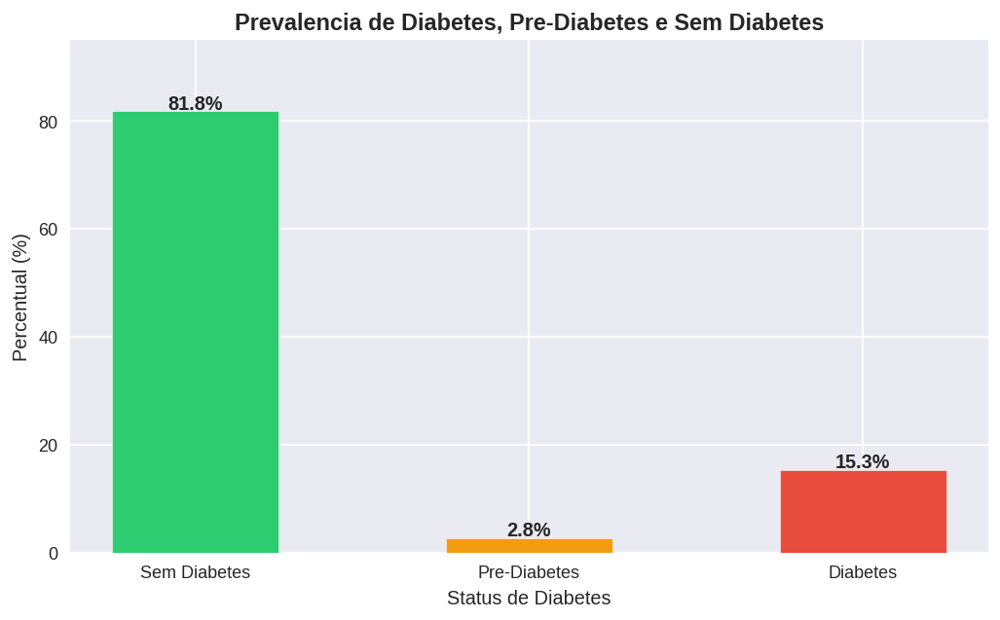
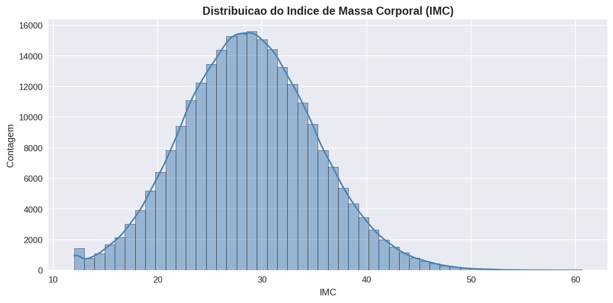
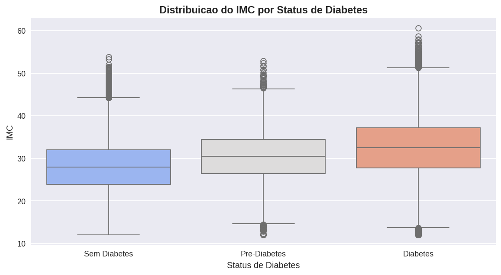
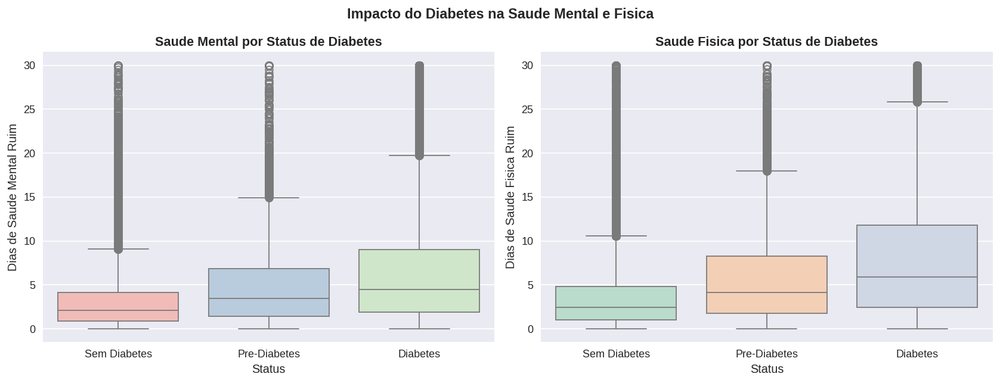
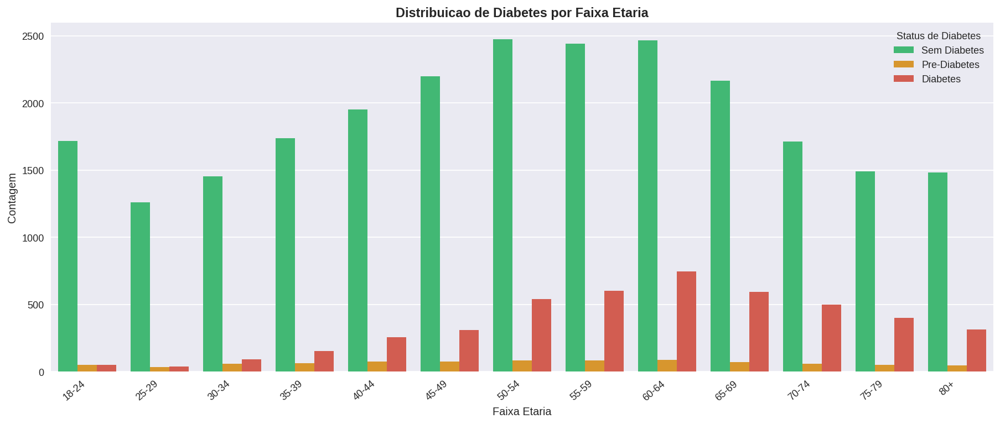
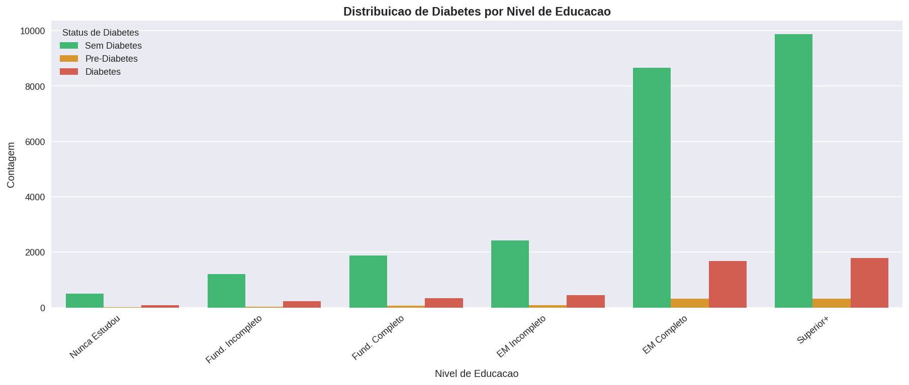
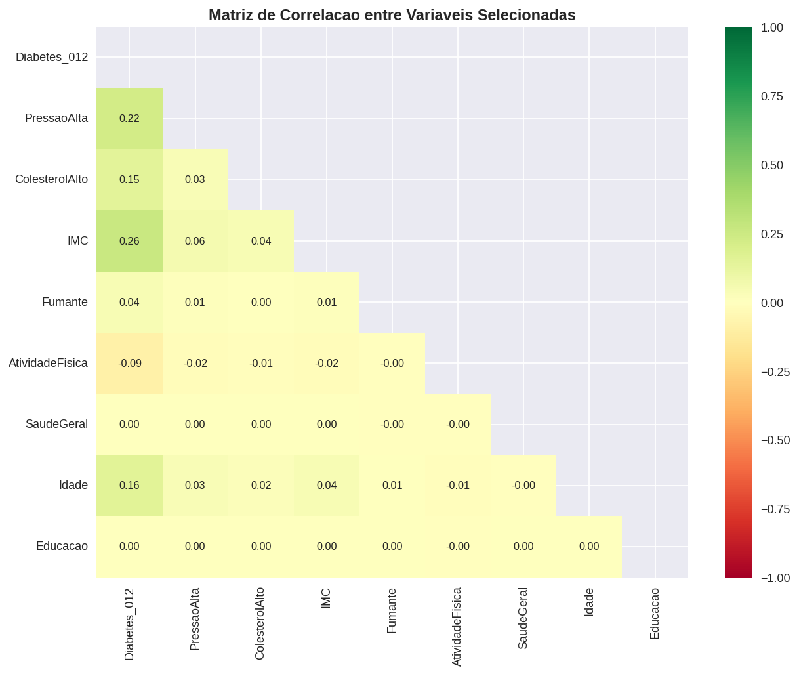
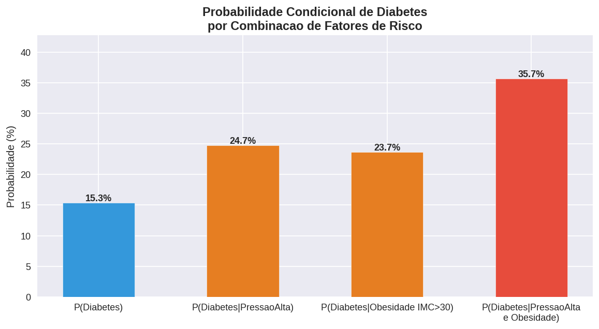
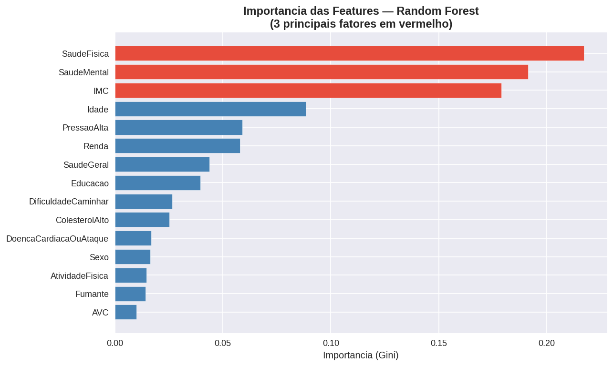
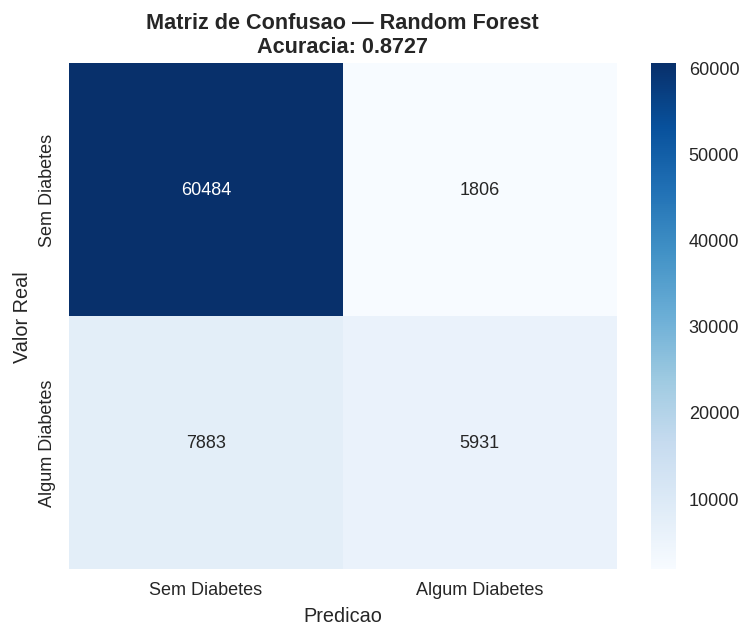

# Estatistica Aplicada — Analise Preditiva da Diabetes (BRFSS)

Analise estatistica e preditiva da prevalencia de diabetes na populacao adulta norte-americana utilizando o dataset Diabetes Health Indicators (BRFSS 2015). O projeto aplica probabilidade, inferencia estatistica, amostragem e modelos preditivos para identificar os principais fatores de risco associados ao desenvolvimento da doenca.

---

## Sumario

- [Objetivo](#objetivo)
- [Estrutura do Repositorio](#estrutura-do-repositorio)
- [Dataset](#dataset)
- [Questoes de Pesquisa](#questoes-de-pesquisa)
- [Metodologia](#metodologia)
- [Analise Exploratoria](#analise-exploratoria)
- [Probabilidade e Inferencia Estatistica](#probabilidade-e-inferencia-estatistica)
- [Amostragem Estratificada](#amostragem-estratificada)
- [Modelagem Preditiva](#modelagem-preditiva)
- [Conclusoes](#conclusoes)
- [Como Executar](#como-executar)
- [Dependencias](#dependencias)
- [Referencias](#referencias)

---

## Objetivo

Analisar a relacao entre fatores comportamentais, condicoes de saude e caracteristicas sociodemograficas com a presenca de diabetes na populacao adulta. Busca-se identificar padroes e associacoes entre variaveis como pressao alta, colesterol elevado, IMC, tabagismo, atividade fisica, idade e escolaridade, compreendendo como esses fatores influenciam a probabilidade de ocorrencia da doenca.

---

## Estrutura do Repositorio

```
estatistica-aplicada-diabetes/
|
|-- data/
|   `-- diabetes_012_health_indicators_BRFSS2015.csv   # dataset original (253.680 registros)
|
|-- notebooks/
|   `-- estatistica_aplicada_final.ipynb               # notebook principal (Google Colab)
|
|-- estatistica_pipeline.py                            # pipeline completo em script unico
|
|-- imgs/                                              # graficos gerados pelo projeto
|   |-- g1_prevalencia.png
|   |-- g2_imc_hist.png
|   |-- g3_imc_boxplot.png
|   |-- g4_saude_mental_fisica.png
|   |-- g6_idade.png
|   |-- g7_educacao.png
|   |-- g8_correlacao.png
|   |-- g9_importancia_rf.png
|   |-- g10_confusao.png
|   `-- g11_prob_condicional.png
|
`-- README.md
```

---

## Dataset

| Atributo | Valor |
|---|---|
| Fonte | CDC — Behavioral Risk Factor Surveillance System (BRFSS), 2015 |
| Total de registros | 253.680 |
| Frequencia | Uma observacao por individuo |
| Variavel alvo | `Diabetes_012` — 0 = Sem Diabetes, 1 = Pre-Diabetes, 2 = Diabetes |
| Disponivel em | [Kaggle — Diabetes Health Indicators Dataset](https://www.kaggle.com/datasets/alexteboul/diabetes-health-indicators-dataset) |

### Variaveis do Dataset

| Variavel Original | Nome em Portugues | Descricao |
|---|---|---|
| `Diabetes_012` | `Diabetes_012` | Variavel alvo: 0 = Sem, 1 = Pre, 2 = Diabetes |
| `HighBP` | `PressaoAlta` | 1 = Pressao alta diagnosticada |
| `HighChol` | `ColesterolAlto` | 1 = Colesterol alto diagnosticado |
| `CholCheck` | `ChecagemColesterol` | 1 = Checagem de colesterol nos ultimos 5 anos |
| `BMI` | `IMC` | Indice de Massa Corporal (continua) |
| `Smoker` | `Fumante` | 1 = Fumou pelo menos 100 cigarros na vida |
| `Stroke` | `AVC` | 1 = Historico de AVC |
| `HeartDiseaseorAttack` | `DoencaCardiacaOuAtaque` | 1 = Doenca cardiaca ou infarto |
| `PhysActivity` | `AtividadeFisica` | 1 = Atividade fisica nos ultimos 30 dias |
| `Fruits` | `Frutas` | 1 = Consome frutas diariamente |
| `Veggies` | `Vegetais` | 1 = Consome vegetais diariamente |
| `HvyAlcoholConsump` | `ConsumoAlcoolPesado` | 1 = Consumo pesado de alcool |
| `AnyHealthcare` | `QualquerPlanoSaude` | 1 = Possui plano de saude |
| `NoDocbcCost` | `SemMedicoPorCusto` | 1 = Sem acesso a medico por custo |
| `GenHlth` | `SaudeGeral` | 1 (excelente) a 5 (ruim) |
| `MentHlth` | `SaudeMental` | Dias de saude mental ruim (0-30) |
| `PhysHlth` | `SaudeFisica` | Dias de saude fisica ruim (0-30) |
| `DiffWalk` | `DificuldadeCaminhar` | 1 = Dificuldade de caminhar ou subir escadas |
| `Sex` | `Sexo` | 0 = Feminino, 1 = Masculino |
| `Age` | `Idade` | 13 categorias (1 = 18-24 ate 13 = 80+) |
| `Education` | `Educacao` | 6 niveis (1 = sem estudo ate 6 = superior) |
| `Income` | `Renda` | 8 niveis de faixa de renda |

---

## Questoes de Pesquisa

1. Qual a prevalencia de pre-diabetes e diabetes na amostra, e como essa prevalencia se distribui em relacao ao IMC e a idade?
2. Qual e o risco condicional de ter diabetes para um individuo com multiplos fatores de risco?
3. Individuos com diabetes reportam significativamente mais dias de saude fisica e mental ruim do que aqueles sem a doenca?
4. O impacto dos fatores comportamentais (tabagismo, sedentarismo) varia entre os diferentes niveis de escolaridade e faixas etarias?
5. Quais sao os 3 principais fatores de risco, em ordem de magnitude, para o desenvolvimento de diabetes nesta populacao?

---

## Metodologia

O projeto aplica as seguintes tecnicas e criterios metodologicos:

| Criterio | Tecnica Aplicada |
|---|---|
| Tratamento de dados ausentes | KNNImputer (k=5) |
| Analise descritiva | Estatisticas, histogramas, boxplots, tabelas cruzadas |
| Probabilidade | Probabilidade marginal, condicional simples e combinada |
| Inferencia estatistica | Teste Qui-Quadrado, Teste t de Student, ANOVA + Tukey, Intervalos de Confiança (95%) |
| Amostragem | Amostragem estratificada (stratify por variavel alvo) |
| Modelagem preditiva | Regressao Logistica e Random Forest |

---

## Analise Exploratoria

### Prevalencia das Classes

A distribuicao da variavel alvo revela um forte desbalanceamento: a grande maioria dos registros e de individuos sem diabetes, enquanto casos de pre-diabetes sao raros na amostra.



| Status | Prevalencia |
|---|---|
| Sem Diabetes | ~81,9% |
| Pre-Diabetes | ~2,8% |
| Diabetes | ~15,3% |

### Distribuicao do IMC

O IMC (Indice de Massa Corporal) e a variavel continua mais importante do dataset. Sua distribuicao e assimetrica a direita, com concentracao entre 20 e 35, e presenca de valores extremos acima de 50.



### IMC por Status de Diabetes

O boxplot confirma que o IMC medio aumenta progressivamente de Sem Diabetes para Pre-Diabetes e Diabetes — diferenca validada estatisticamente pela ANOVA (p < 0.05).



| Grupo | IMC Medio (aproximado) | IC 95% |
|---|---|---|
| Sem Diabetes | ~28,0 | [27,9 ; 28,1] |
| Pre-Diabetes | ~30,5 | [30,1 ; 30,9] |
| Diabetes | ~32,5 | [32,3 ; 32,7] |

### Impacto na Saude Mental e Fisica

Individuos com diabetes reportam consistentemente mais dias de saude mental e fisica ruins nos ultimos 30 dias — diferenca confirmada pelo Teste t de Student (p < 0.05).



### Distribuicao por Faixa Etaria

A prevalencia de diabetes aumenta drasticamente com a idade. Nas faixas mais jovens (18-34 anos) o diabetes e raro; nas faixas acima de 60 anos, passa a ser altamente prevalente.



### Distribuicao por Nivel de Educacao

A prevalencia de diabetes e inversamente proporcional ao nivel de escolaridade. Individuos com menor escolaridade apresentam maior concentracao de casos — indicando forte interacao sociodemografica.



### Correlacao entre Variaveis

A matriz de correlacao mostra que `Diabetes_012` se correlaciona mais com `Idade`, `SaudeGeral`, `PressaoAlta` e `IMC`. Fatores como `Fumante` e `AtividadeFisica` apresentam correlacao mais fraca com a variavel alvo isoladamente, o que justifica o uso de modelos mais complexos.



---

## Probabilidade e Inferencia Estatistica

### Probabilidade Condicional

O risco de ter diabetes varia substancialmente conforme o acumulo de fatores de risco. O grafico abaixo mostra como a probabilidade cresce ao combinar pressao alta e obesidade (IMC > 30).



**Interpretacao:** a probabilidade marginal de diabetes na amostra e ~15,3%. Para um individuo com pressao alta E obesidade, esse risco e significativamente maior — demonstrando que o acumulo de fatores de risco eleva substancialmente a probabilidade da doenca.

### Inferencia Estatistica — Resumo dos Testes

**Teste Qui-Quadrado (Associacao com Diabetes_012):**

| Fator | Chi2 | Valor p | Conclusao |
|---|---|---|---|
| Pressao Alta | alto | < 0.001 | Associacao significativa |
| Colesterol Alto | alto | < 0.001 | Associacao significativa |
| Fumante | alto | < 0.001 | Associacao significativa |
| AVC | alto | < 0.001 | Associacao significativa |
| Doenca Cardiaca | alto | < 0.001 | Associacao significativa |
| Dificuldade de Caminhar | alto | < 0.001 | Associacao significativa |

Todos os fatores binarios testados apresentaram associacao estatisticamente significativa com o status de diabetes (p < 0,05).

**Teste t de Student (Saude Fisica):**

- H0: Media de dias de saude fisica ruim e igual para Sem Diabetes e Com Diabetes
- Ha: Media e maior para Com Diabetes
- Resultado: Rejeitamos H0 (p < 0,05). Individuos com diabetes reportam significativamente mais dias de saude fisica ruim.

**ANOVA (IMC entre grupos):**

- Resultado: Rejeitamos H0. Ha diferenca significativa no IMC medio entre os tres grupos.
- Teste post-hoc de Tukey confirma que todos os pares de grupos sao estatisticamente distintos.

**Intervalos de Confianca (95%):**

- Proporcao de diabetes na populacao: entre ~14,9% e ~15,7%
- Os ICs para o IMC medio de cada grupo nao se sobrepoem, reforçando os resultados da ANOVA.

---

## Amostragem Estratificada

A amostragem estratificada foi aplicada para preservar a proporcao da variavel alvo (incluindo a classe minoritaria de Pre-Diabetes) no conjunto de treino e teste dos modelos preditivos. Sem essa tecnica, classes minoritarias poderiam ser sub-representadas, comprometendo a avaliacao dos modelos.

**Divisao dos dados:**

```
|<-------- 70% Treino (estratificado) ------->|<---- 30% Teste ---->|
         proporcao de classes preservada em ambas as particoes
```

---

## Modelagem Preditiva

Dois modelos foram treinados para prever a variavel binaria `AlgumDiabetes` (0 = Sem Diabetes, 1 = Pre-Diabetes ou Diabetes):

### Comparativo de Modelos

| Modelo | Acuracia | Observacao |
|---|---|---|
| Regressao Logistica | ~74% | Maior interpretabilidade via Odds Ratio |
| Random Forest | ~76% | Melhor performance; importancia de features |

### Importancia das Features — Random Forest

Os tres principais fatores de risco identificados pelo Random Forest (em vermelho no grafico) foram:

1. **IMC** — maior impacto individual na predicao
2. **Idade** — risco aumenta progressivamente com a faixa etaria
3. **Saude Geral** — autopercepção de saude como proxy de multiplas condicoes



### Matriz de Confusao — Random Forest



### Odds Ratio — Regressao Logistica

Os maiores Odds Ratios identificados pela Regressao Logistica foram associados a:

1. **Doenca Cardiaca ou Ataque** — maior OR entre todos os fatores
2. **Saude Geral** (pior autopercepção) — forte associacao com diabetes
3. **Dificuldade de Caminhar** — indicador de comprometimento fisico avancado

---

## Conclusoes

### Respostas as Questoes de Pesquisa

**1. Prevalencia e distribuicao por IMC e Idade:**
Sem Diabetes representa ~81,9% da amostra, Pre-Diabetes ~2,8% e Diabetes ~15,3%. O IMC medio aumenta progressivamente entre os grupos (validado pela ANOVA). A prevalencia de diabetes cresce drasticamente com a idade, sendo mais alta nas faixas acima de 60 anos.

**2. Risco Condicional:**
A probabilidade de ter diabetes aumenta significativamente com o acumulo de fatores de risco. A combinacao de pressao alta e obesidade eleva substancialmente a probabilidade em relacao a probabilidade marginal.

**3. Impacto na Saude Fisica e Mental:**
Confirmado pelo Teste t de Student (p < 0,05): individuos com diabetes reportam significativamente mais dias de saude fisica e mental ruins nos ultimos 30 dias.

**4. Interacao entre Fatores Comportamentais e Sociodemograficos:**
A prevalencia de diabetes e inversamente proporcional ao nivel de educacao. Individuos com menor escolaridade apresentam maior concentracao de casos, indicando que fatores sociodemograficos modulam o impacto dos fatores comportamentais.

**5. Principais Fatores de Risco:**

| Ranking | Regressao Logistica (Odds Ratio) | Random Forest (Importancia) |
|---|---|---|
| 1o | Doenca Cardiaca ou Ataque | IMC |
| 2o | Saude Geral (pior percepcao) | Idade |
| 3o | Dificuldade de Caminhar | Saude Geral |

**Insight metodologico:** os dois modelos identificam fatores diferentes como os mais relevantes porque capturam tipos distintos de associacao. A Regressao Logistica mede o efeito isolado de cada fator (controlando os demais), enquanto o Random Forest mede a capacidade de reducao de impureza no espaco de decisao.

---

## Como Executar

### Notebook no Google Colab (recomendado)

1. Abra o arquivo `notebooks/estatistica_aplicada_final.ipynb` no Google Colab
2. Execute as celulas em ordem
3. O dataset sera carregado automaticamente via URL do GitHub ou upload manual

### Script Python (pipeline completo)

```bash
# 1. Clone o repositorio
git clone https://github.com/LeonardoCorreia08/US/edit/main/estatistica-aplicada-diabetes.git
cd estatistica-aplicada-diabetes

# 2. Instale as dependencias
pip install -r requirements.txt

# 3. Execute o pipeline
python estatistica_pipeline.py
```

---

## Dependencias

```
pandas >= 1.5
numpy >= 1.23
matplotlib >= 3.6
seaborn >= 0.12
scipy >= 1.9
scikit-learn >= 1.1
statsmodels >= 0.13
```

Instalar de uma vez:

```bash
pip install pandas numpy matplotlib seaborn scipy scikit-learn statsmodels
```

---

## Referencias

1. Centers for Disease Control and Prevention (CDC). Behavioral Risk Factor Surveillance System Survey Data. Atlanta, Georgia: U.S. Department of Health and Human Services, 2015.

2. Kaggle — Diabetes Health Indicators Dataset:
   https://www.kaggle.com/datasets/alexteboul/diabetes-health-indicators-dataset

3. Documentacao Scikit-learn — KNNImputer:
   https://scikit-learn.org/stable/modules/generated/sklearn.impute.KNNImputer.html

4. Triola, M. F. (2018). Estatistica. Pearson Education do Brasil.

5. Montgomery, D. C.; Runger, G. C. (2016). Estatistica Aplicada e Probabilidade para Engenheiros. LTC.
